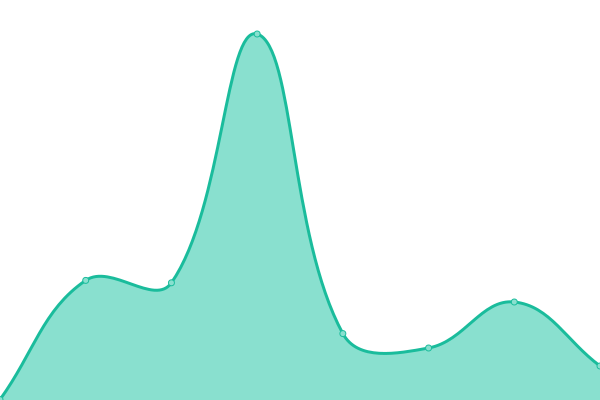
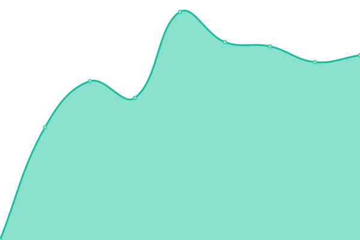

# [📈 Live Status](https://status.lincbrain.org): <!--live status--> **🟩 All systems operational**

This repository contains the open-source uptime monitor and status page for [LINC](https://connects.mgh.harvard.edu) resources, powered by [Upptime](https://github.com/upptime/upptime).

With [Upptime](https://upptime.js.org), you can get your own unlimited and free uptime monitor and status page, powered entirely by a GitHub repository. We use [Issues](https://github.com/lincbrain/linc-upptime/issues) as incident reports, [Actions](https://github.com/lincbrain/linc-upptime/actions) as uptime monitors, and [Pages](https://status.lincbrain.org) for the status page.

<!--start: status pages-->
<!-- This summary is generated by Upptime (https://github.com/upptime/upptime) -->
<!-- Do not edit this manually, your changes will be overwritten -->
<!-- prettier-ignore -->
| URL | Status | History | Response Time | Uptime |
| --- | ------ | ------- | ------------- | ------ |
|  [Data portal](https://lincbrain.org) | 🟩 Up | [data-portal.yml](https://github.com/lincbrain/linc-upptime/commits/HEAD/history/data-portal.yml) | 

 411ms
     
 | 

<a href="https://status.lincbrain.org/history/data-portal">99.90%</a>
    

|  [DANDI Hub](https://hub.dandiarchive.org) | 🟩 Up | [dandi-hub.yml](https://github.com/lincbrain/linc-upptime/commits/HEAD/history/dandi-hub.yml) | 

 435ms
     
 | 

<a href="https://status.lincbrain.org/history/dandi-hub">100.00%</a>
    

|  [Documentation](https://docs.lincbrain.org) | 🟩 Up | [documentation.yml](https://github.com/lincbrain/linc-upptime/commits/HEAD/history/documentation.yml) | 

 314ms
     
 | 

<a href="https://status.lincbrain.org/history/documentation">100.00%</a>
    

|  [Dashboard](https://dashboard.lincbrain.org) | 🟩 Up | [dashboard.yml](https://github.com/lincbrain/linc-upptime/commits/HEAD/history/dashboard.yml) | 

 324ms
     
 | 

<a href="https://status.lincbrain.org/history/dashboard">100.00%</a>
    

|  [Homepage](https://connects.mgh.harvard.edu) | 🟩 Up | [homepage.yml](https://github.com/lincbrain/linc-upptime/commits/HEAD/history/homepage.yml) | 

 1852ms
     
 | 

<a href="https://status.lincbrain.org/history/homepage">88.05%</a>
    

<!--end: status pages-->

[**Visit our status website →**](https://status.lincbrain.org)

## 📄 License

- Code: [MIT](./LICENSE) © [Anand Chowdhary](https://anandchowdhary.com), supported by [Pabio](https://pabio.com)
- Data in the `./history` directory: [Open Database License](https://opendatacommons.org/licenses/odbl/1-0/)
